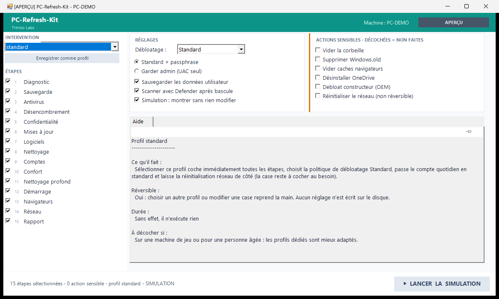
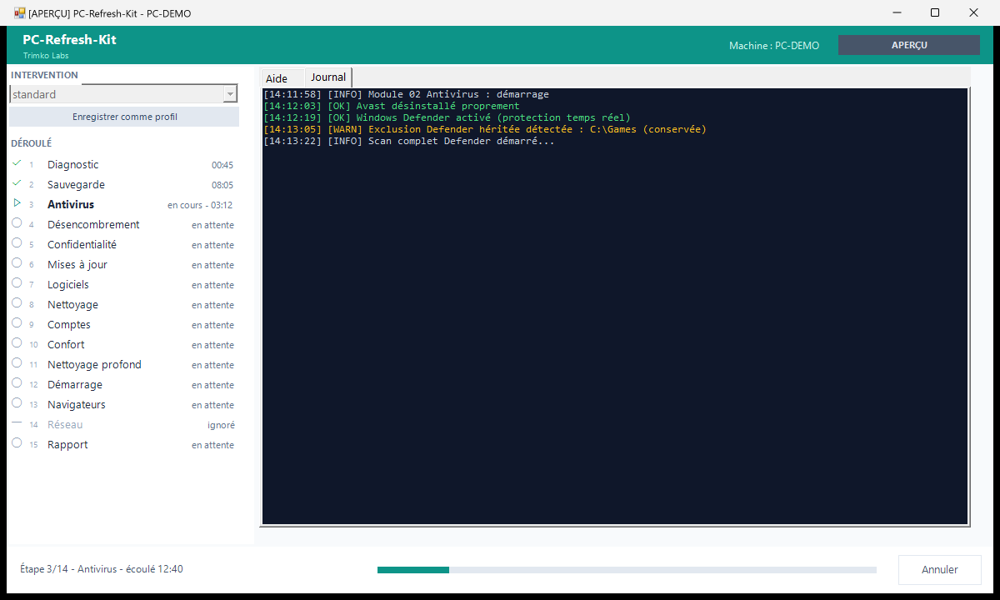
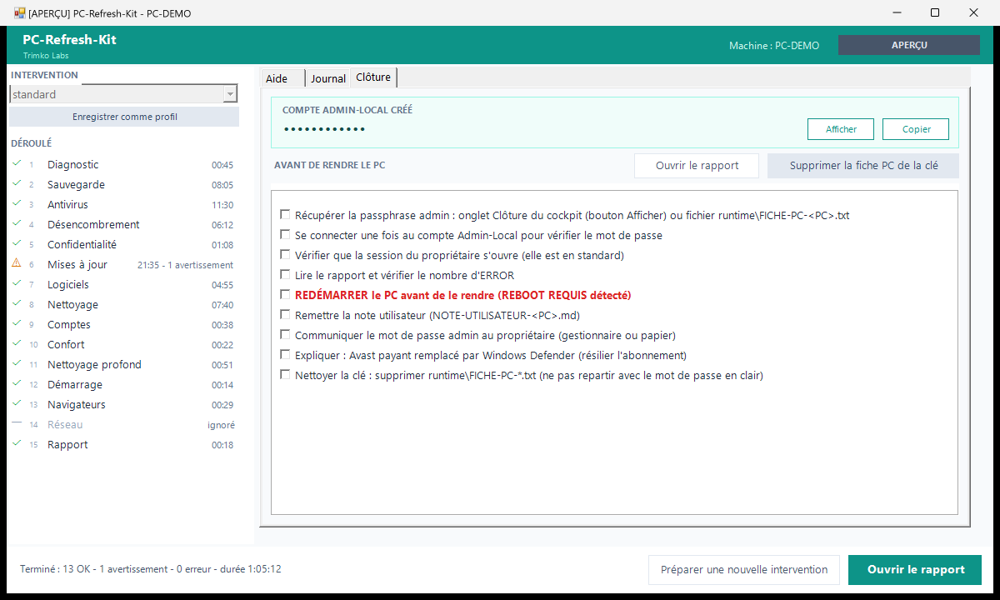

# PC-Refresh-Kit

[](https://github.com/trimko-labs/PC-Refresh-Kit/actions/workflows/ci.yml)


Kit PowerShell portable pour remettre a neuf un PC Windows 10/11 depuis une cle USB.
Zero dependance externe - PowerShell 5.1 natif, aucun module a installer.

## Téléchargement

Dernière version : voir la page [Releases](https://github.com/trimko-labs/PC-Refresh-Kit/releases/latest).
Télécharger le `.zip`, l'extraire sur une clé USB, double-cliquer `Lancer.bat`.

Site du projet : https://kit.trimko.com

## Captures



Préparer : profil d'intervention appliqué d'emblée, étapes 1 à 15, réglages et actions sensibles,
aide intégrée. La barre d'action résume ce qui sera fait.



Exécuter : chaque étape affiche son état et sa durée sur la timeline, l'onglet Journal s'ouvre et
défile, la barre porte la progression.



Clôturer : passphrase masquée à remettre au propriétaire, checklist avant restitution, rapport.

## Aide intégrée

Le cockpit affiche l'onglet **Aide** à droite ; le **Journal** s'ajoute au lancement de
l'intervention et la **Clôture** en fin de run. Survoler une étape ou une option affiche dans
l'onglet Aide ce qu'elle fait, ce qui est protégé, si l'action est réversible, combien de temps
elle prend et dans quel cas la décocher. L'infobulle donne le résumé, l'onglet donne le détail.

Le panneau ne suit pas le curseur au pixel près : il attend un court délai de survol avant de
remplacer ce qui est affiché, si bien que traverser l'écran pour aller lire ne fait plus
disparaître la rubrique en cours. Entrer dans le panneau fige son contenu, le temps de lire et de
faire défiler. Une épingle en tête du panneau verrouille la rubrique affichée quoi qu'on survole
ensuite ; un second clic ou la touche Échap la libère.

Le contenu vit dans `config/help.fr.json`, seule source de vérité. Un contrôle ajouté à
l'interface sans entrée correspondante fait échouer la CI (`tests/Help.Tests.ps1`).

## Prerequis

- Windows 10 (1903+) ou Windows 11
- PowerShell 5.1 (inclus dans Windows)
- Session ouverte avec un compte administrateur
- Connexion internet (mises a jour et installation de logiciels)
- Disque externe optionnel pour la sauvegarde des donnees (module 01)

## Usage rapide

### Interface graphique (recommande)

Double-cliquer sur `Lancer.bat` : la fenêtre demande l'élévation administrateur (UAC), puis ouvre
le cockpit sur le profil standard déjà appliqué. Ajuster les étapes et les actions souhaitées, puis
cliquer le bouton principal de la barre d'action en bas de la fenêtre : LANCER L'INTERVENTION, ou
LANCER LA SIMULATION si la case Simulation est cochée. Le déroulé s'affiche en direct ; en fin de
run, l'onglet Clôture présente la passphrase administrateur masquée (boutons Afficher et Copier),
la checklist de restitution et le rapport.

En secours (si la GUI ne s'ouvre pas sur une machine), `Lancer-Console.bat` ouvre le menu texte.

### Ligne de commande (fallback)

Ouvrir PowerShell en tant qu'administrateur, naviguer vers le kit, lancer l'orchestrateur :

```powershell
Set-Location C:\chemin\PC-Refresh-Kit
powershell -ExecutionPolicy Bypass -File .\Run.ps1
```

Le menu interactif s'affiche. Taper `A` pour tout executer, ou le numero d'un module specifique.

### Aperçu sans rien modifier (simulation, `-WhatIf`)

Double-cliquer sur `Lancer-Demo.bat` : le cockpit s'ouvre avec la case Simulation déjà cochée, le
bouton principal sur LANCER LA SIMULATION et le préfixe [SIMULATION] dans le titre de la fenêtre.
Toutes les étapes sont simulées et le journal défile normalement, mais aucune modification n'est
appliquée. C'est le point d'entrée à utiliser pour une démonstration sur une machine qu'on ne
veut pas toucher.

En ligne de commande :

```powershell
powershell -ExecutionPolicy Bypass -File .\Run.ps1 -WhatIf
```

### Aperçu de l'interface sans droits administrateur

```powershell
powershell -ExecutionPolicy Bypass -File .\Run-GUI.ps1 -UiPreview
powershell -ExecutionPolicy Bypass -File .\Run-GUI.ps1 -UiPreview -PreviewPhase Running
powershell -ExecutionPolicy Bypass -File .\Run-GUI.ps1 -UiPreview -PreviewPhase Done
```

Ouvre le cockpit sans élévation, LANCER désactivé, avec des données de démonstration pour
chaque phase. Sert aux contributeurs et aux captures d'écran : aucune action n'est exécutée et rien
n'est modifié sur la machine ; le kit crée seulement son dossier de journaux `runtime\logs` sous son
propre répertoire.

## Modules

| N  | Fichier           | Description                                           | Modifie le systeme |
|----|-------------------|-------------------------------------------------------|--------------------|
| 00 | 00-Diagnostic.ps1 | Inventaire machine : CPU, RAM, disques, antivirus     | Non (lecture seule)|
| 01 | 01-Backup.ps1     | Point de restauration systeme + copie des donnees     | Cree des fichiers  |
| 02 | 02-Antivirus.ps1  | Supprime Avast, active et lance Windows Defender      | Oui                |
| 03 | 03-Debloat.ps1    | Supprime bloatware Store et OEM (ASUS, Dell, HP...)   | Oui                |
| 04 | 04-Privacy.ps1    | Reduit la telemetrie Windows, installe TelemetryGuard | Oui                |
| 05 | 05-Updates.ps1    | Windows Update + winget upgrade --all                 | Oui                |
| 06 | 06-Software.ps1   | Installe Firefox, 7-Zip, VLC, Sumatra PDF, LibreOffice| Oui                |
| 07 | 07-Cleanup.ps1    | Vide temp/cache, DISM, SFC, defrag/TRIM selon disque  | Oui                |
| 08 | 08-Accounts.ps1   | Compte admin separe + compte courant en standard      | Oui                |
| 09 | 09-Comfort.ps1    | OneDrive desactive, extensions visibles, suggestions OFF | Oui             |
| 10 | 10-Report.ps1     | Rapport d'intervention + note utilisateur             | Cree des fichiers  |
| 11 | 11-DeepClean.ps1  | Raccourcis morts + dossiers résiduels post-débloatage | Oui (suppression)  |
| 12 | 12-Startup.ps1    | Désactive (réversible) les autostarts indésirables    | Oui (réversible)   |
| 13 | 13-BrowserPUP.ps1 | Nettoyage policy navigateur Chrome/Edge + rapport     | Oui (réversible)   |
| 14 | 14-Undo.ps1       | Annule (restaure) les changements réversibles du dernier run | Restaure (12/13)   |
| 15 | 15-Network.ps1    | Réinitialise Winsock, la pile IP, le cache et le bail DHCP | Oui (non réversible) |

L'interface numérote les étapes 1 à 15 dans l'ordre réel d'exécution ; les identifiants 00 à 15
ci-dessus sont les noms de fichiers, visibles dans les logs et le rapport.

## Lancer un seul module

```powershell
powershell -ExecutionPolicy Bypass -File .\modules\07-Cleanup.ps1
powershell -ExecutionPolicy Bypass -File .\modules\07-Cleanup.ps1 -WhatIf
```

## Personnaliser les logiciels installes (module 06)

Editer `config/apps.json` :

```json
[
  { "name": "VLC",    "wingetId": "VideoLAN.VLC",  "optional": false },
  { "name": "Chrome", "wingetId": "Google.Chrome", "optional": true  }
]
```

- `optional: false` : installe sans demander
- `optional: true` : demande une confirmation individuelle

Pour trouver un identifiant winget : `winget search "nom du logiciel"`

## Personnaliser le debloatage (module 03)

- `config/debloat-store.json` : patterns AppX a supprimer / liste protegee a ne pas toucher
- `config/oem-bloat/ASUS.json` (et autres marques) : desinstalleurs OEM specifiques

Ne jamais retirer les entrees de la cle `keep` - elles protegent les composants systeme critiques
(Windows Store, Defender, winget, pilotes GPU...).

## Usage depuis une cle USB

1. Copier le dossier `PC-Refresh-Kit` a la racine de la cle USB
2. Sur le PC cible, ouvrir PowerShell en administrateur (clic droit > Executer en tant qu'administrateur)
3. Naviguer vers la cle : `cd E:\PC-Refresh-Kit` (adapter la lettre de lecteur)
4. Lancer : `powershell -ExecutionPolicy Bypass -File .\Run.ps1`

Les logs et rapports sont ecrits dans `runtime/` au meme endroit que le kit (sur la cle USB
ou sur le disque selon ou le kit est lance).

## Fichiers generes (runtime/)

Tous les fichiers dans `runtime/` sont exclus du depot Git.

| Fichier                             | Contenu                                    |
|-------------------------------------|--------------------------------------------|
| `runtime/logs/kit-<PC>-<date>.log` | Log complet du run                         |
| `runtime/diagnostic-<PC>.json`     | Inventaire machine complet (module 00)     |
| `runtime/FICHE-PC-<PC>.txt`        | Fiche avec mot de passe admin (module 08)  |
| `runtime/RAPPORT-<PC>-<date>.txt`  | Rapport d'intervention agrege (module 10)  |
| `runtime/NOTE-UTILISATEUR-<PC>.md` | Note raccourcis pour l'utilisateur (module 10) |

**Ne jamais committer `runtime/`. Ne jamais partager `FICHE-PC-*.txt`.**

## Tests

Les tests couvrent les fonctions pures de `lib/Common.ps1` (Pester v5 requis) :

```powershell
Invoke-Pester .\tests\Common.Tests.ps1 -Output Detailed
```

Installer Pester v5 si absent : `Install-Module Pester -Force -SkipPublisherCheck`

`Run-GUI.ps1 -SelfTest` déroule un parcours utilisateur scripté (profils, étapes, mode, journal) sans afficher la fenêtre ; il fait partie de la CI.

```powershell
powershell -ExecutionPolicy Bypass -File .\Run-GUI.ps1 -SelfTest
```

## Securite

- Aucun fichier personnel (photos, documents) n'est jamais supprime ou deplace
- Toute action destructive exige une confirmation interactive
- `-WhatIf` sur tous les modules pour inspecter sans agir
- Garde-fou "au moins 2 admins" (module 08) : impossible de se verrouiller hors du PC
- Detection SSD/HDD (module 07) : jamais de defragmentation sur un SSD
- Debloatage OEM (module 03) : toujours avec confirmation et liste protegee
- Le mot de passe administrateur est une passphrase memorisable (mots + chiffres), generee par `New-StrongPassword -Passphrase`

### Garde-fous automatiques (v1.1)

- **Protection gamer (Game Pass)** : Xbox et Gaming App ne sont jamais supprimes automatiquement si Gaming Services est installe avec des jeux. En mode `-All`, suppression uniquement si aucun signal Game Pass detecte.
- **Apps conditionnelles** : Spotify, Lien avec le telephone, Skype, Films & TV passes en detection d'usage (fichiers recents dans les 90 jours). Gardes si utilises, sinon confirmation interactively (mode `-Force` : suppression automatique).
- **Skip hors-ligne propre** : modules 05 (Windows Update) et 06 (winget) testent une connexion TCP 443 reelle en amont. Si hors-ligne : `exit 0` avec WARN, aucune erreur COM ou winget en aveugle.
- **Espace disque avant DISM** : module 07 verifie l'espace libre C: avant `/RestoreHealth`. Moins de 8 Go disponibles : DISM ignore avec WARN, relancer apres nettoyage.
- **MAJ en cours protegee** : purge du cache Windows Update ignoree si `IUpdateInstaller.IsBusy` ou transfert BITS actif, pour ne pas interrompre une mise a jour en cours.
- **Alerte antivirus tiers** : si un AV non-Defender avec protection temps reel est detecte, WARN prominent en tete des modules 03 et 04 (peut bloquer silencieusement AppX et registre).
- **Resume redemarrage** : module 10 scanne les logs (marqueurs `REBOOT REQUIS`, code `3010`) et lit le registre pending-reboot. Section proeminente dans le rapport + banniere console jaune + flag `runtime/reboot-required.flag`.
- **Multi-profils Chrome/Edge** : module 07 enumere `Default` + tous les `Profile *` au lieu du seul profil Default.

## Nouveautés v1.4

### Module 11 - DeepClean (nettoyage résiduel)

Le module `11-DeepClean.ps1` effectue deux opérations de nettoyage post-débloatage :

- **Raccourcis morts** : parcourt le menu Démarrer (`%ProgramData%\Microsoft\Windows\Start Menu` et `%AppData%\Microsoft\Windows\Start Menu`) et supprime les raccourcis `.lnk` dont la cible locale n'existe plus.
- **Dossiers résiduels** : supprime les dossiers laissés par des apps désinstallées, selon deux sources combinées : la liste blanche `config/deepclean-residuals.json` et la liste des apps effectivement supprimées lors du dernier run du module 03 (lue dans le log Debloat).

Ce que le module 11 ne fait **pas** :

- Aucune opération sur le registre (ni `Remove-ItemProperty`, ni modification de clés HK).
- Aucun DISM - déjà couvert intégralement par le module 07-Cleanup.

Le garde-fou `Test-ResidualPathAllowed` est appelé avant toute suppression de dossier : seuls les sous-dossiers stricts des racines autorisées (`Program Files`, `ProgramData`, `AppData\Local`, `AppData\Roaming`) peuvent être supprimés. La racine elle-même et tout chemin hors-liste sont ignorés.

**Limite connue** : un raccourci `.lnk` dont la cible pointe vers un lecteur réseau mappé (ex : `Z:\`) momentanément hors-ligne peut être considéré comme mort et supprimé. Sans gravité - un raccourci se recrée - et le risque est faible en contexte de remise à neuf (les partages réseau ne sont généralement pas connectés lors d'une intervention).

### Lanceur autonome Lancer-DeepClean.bat

`Lancer-DeepClean.bat` lance le module 11 seul, sans passer par le menu complet ni repasser les ~30 minutes de DISM/SFC du module 07. Utile pour un nettoyage résiduel rapide après un run complet, ou pour relancer le DeepClean après une session de débloatage manuelle.

```powershell
# Équivalent en ligne de commande
powershell -ExecutionPolicy Bypass -File .\modules\11-DeepClean.ps1
```

### Bouton "Annuler" du cockpit GUI

Le bouton **Annuler** arrête proprement le module en cours d'exécution et vide la file des modules restants, sans fermer la fenêtre du cockpit. Le système reste dans l'état atteint à l'instant de l'annulation. Le kit étant non-destructif (aucun fichier personnel supprimé, toutes les actions réversibles ou avec point de restauration préalable), interrompre en cours de route ne laisse pas le PC dans un état dégradé.

## Nouveautés v1.5

### Module 12 - Startup (désactivation réversible des autostarts)

Le module `12-Startup.ps1` désactive les programmes au démarrage indésirables selon la liste noire `config/startup-blacklist.json`. Trois mécanismes, tous réversibles :

- **Clés Run (HKLM/HKCU)** : désactivation via `StartupApproved` (la valeur binaire est modifiée, jamais supprimée). Réactivable dans le Gestionnaire des tâches > onglet Démarrage.
- **Raccourcis du dossier Démarrage** : les `.lnk` correspondants sont **déplacés** vers `%ProgramData%\PC-Refresh-Kit\Startup-disabled-<date>`, jamais supprimés. Réactivation en redéposant le raccourci dans le dossier Démarrage.
- **Tâches planifiées logon/boot** : désactivation via `Disable-ScheduledTask`, jamais `Unregister`. Réactivation via `Enable-ScheduledTask` ou l'interface Planificateur de tâches.

Le module ne supprime jamais quoi que ce soit de façon irréversible. Rien hors liste noire n'est touché.

### Module 13 - BrowserPUP (nettoyage policy navigateur)

Le module `13-BrowserPUP.ps1` retire les détournements posés par **policy de registre** sur Chrome et Edge : moteur de recherche forcé, page d'accueil forcée, nouvel onglet forcé, et extensions force-installées figurant dans `config/browser-pup.json`. Avant toute suppression, la clé de registre concernée est exportée en `.reg` dans `%ProgramData%\PC-Refresh-Kit\BrowserPUP-backup-<date>`. Si l'export échoue, les suppressions de la clé concernée sont annulées.

Le reste des extensions force-installées (hors liste noire) est uniquement **rapporté** dans le log, sans modification.

**Limite connue** : sur une machine d'entreprise où des policies seraient légitimes (cas rare en contexte de remise à neuf grand public), elles seraient retirées. Le backup `.reg` permet un réimport immédiat par double-clic.

### Lanceurs autonomes

`Lancer-Startup.bat` et `Lancer-BrowserClean.bat` permettent de lancer les modules 12 et 13 seuls, sans repasser par le menu complet. Utiles pour un passage ciblé après un run complet, ou sur une machine déjà en ordre qui présente seulement un problème d'autostart ou de navigateur.

### Réactivation

- **Autostarts (module 12)** : Gestionnaire des tâches > onglet Démarrage pour les entrées Run ; copier le `.lnk` depuis le dossier de sauvegarde pour les raccourcis ; `Enable-ScheduledTask` pour les tâches planifiées.
- **Policies navigateur (module 13)** : double-clic sur le fichier `.reg` de sauvegarde dans `%ProgramData%\PC-Refresh-Kit\BrowserPUP-backup-<date>` pour réimporter intégralement la clé.

## Nouveautés v1.6

### Module 14 - Undo (réversibilité totale, annulation en un clic)

Les modules réversibles 12 (Startup) et 13 (BrowserPUP) écrivent désormais un **manifeste d'annulation** dans `runtime/undo/undo-<run>.json`. Ce manifeste décrit précisément chaque action réversible effectuée pendant le run. Comme il est ancré sur le log unifié, les modules 12 et 13 d'un même run GUI écrivent dans le même manifeste.

Le module `14-Undo.ps1` lit le manifeste le plus récent et **défait toutes les actions dans l'ordre inverse** (LIFO) :

- **Autostart clé Run** : réactivé via `StartupApproved` (octet 0x02).
- **Raccourci Démarrage** : le `.lnk` est remis dans son dossier Démarrage d'origine.
- **Tâche planifiée** : `Enable-ScheduledTask`.
- **Policy/extension navigateur** : le `.reg` de sauvegarde est réimporté, restaurant l'état d'avant la suppression.

Le module 14 ne supprime jamais rien (il restaure seulement) et supporte `-WhatIf` pour prévisualiser ce qui serait annulé. L'écriture du manifeste par 12 et 13 est défensive : si elle échoue, elle n'interrompt jamais le module en cours.

```powershell
# Aperçu sans rien restaurer
powershell -ExecutionPolicy Bypass -File .\modules\14-Undo.ps1 -WhatIf
# Restauration réelle (ou double-clic sur Lancer-Annuler.bat)
powershell -ExecutionPolicy Bypass -File .\modules\14-Undo.ps1
```

`Lancer-Annuler.bat` lance le module 14 seul, avec auto-élévation.

### Rapport HTML professionnel (module 10)

En plus du rapport `.txt` (conservé), le module 10 génère désormais `RAPPORT-<PC>-<date>.html` : un document HTML autonome (zéro ressource externe), au style sobre teal, avec bilan coloré (OK/avertissements/erreurs), bannière de redémarrage, informations machine, synthèse par module et journal complet. Tout contenu issu des logs ou du diagnostic est échappé (anti-injection). Le bouton "Ouvrir le rapport" du cockpit ouvre le HTML dans le navigateur (sinon le TXT dans Notepad++).

### Cockpit plus lisible

- **Journal coloré** : la zone de log de la GUI colore chaque ligne selon son niveau (OK vert, avertissement orange, erreur rouge, simulation teal). La coloration est défensive et ne peut jamais interrompre le suivi.
- **Temps écoulé** : la barre de titre affiche la durée du run en direct, puis la durée totale à la fin.
- **Bilan final** : un récapitulatif (OK / avertissements / erreurs + durée) s'ajoute au journal en fin de run.

### Robustesse anti-gel (module 07)

Les deux appels `DISM` (`/StartComponentCleanup` et `/RestoreHealth`) sont désormais redirigés vers un fichier au niveau `cmd` (helper `Invoke-DismToFile`), comme l'était déjà `sfc /scannow`. DISM affiche sa progression via l'API console ; lancé par la GUI dans un process sans console, l'ancien `& DISM ... 2>&1` exposait au même risque de gel que le `sfc` qui avait figé ~1h30. La redirection vers fichier supprime ce risque latent.

### Nettoyage rapide : Lancer-Nettoyage.bat (et -SkipRepair)

`Lancer-Nettoyage.bat` lance le module 07 seul en mode **nettoyage rapide** (`-SkipRepair`) : il vide les fichiers temporaires, le cache Windows Update, lance Disk Cleanup (cleanmgr) et le TRIM/défrag, mais **saute le DISM (qui peut durer 30 à 60 minutes) et le SFC** (réparation d'intégrité, pas du nettoyage). Idéal pour récupérer de l'espace sur les fichiers système Windows inutiles sans attendre le passage complet. Il ne vide ni la corbeille ni les caches navigateur (non demandés). Pour le nettoyage complet avec compactage du store de composants, utiliser la GUI en ne cochant que Cleanup.

```powershell
# Équivalent en ligne de commande
powershell -ExecutionPolicy Bypass -File .\modules\07-Cleanup.ps1 -Unattended -SkipRepair
```

## Nouveautés v1.7 - Fiabilité terrain

Correctifs issus du premier run réel (2026-07-01) et d'une revue multi-agents :

- **Backup OneDrive-aware** : les dossiers utilisateur sont résolus via la redirection des dossiers connus (`GetFolderPath`). Sur un PC où OneDrive a déplacé Documents/Bureau/Images, le kit sauvegarde désormais les VRAIES données (l'ancien code copiait le dossier local, potentiellement vide). Garde-fou : WARN si un dossier résolu est vide alors qu'OneDrive est présent.
- **Batterie toutes langues** : le parsing du rapport `powercfg /batteryreport` s'ancre sur l'unité mWh au lieu des libellés anglais ; la santé batterie fonctionne sur les Windows en français.
- **winget** : le retry sur l'erreur 0x8A150042 fonctionne réellement (bug de comparaison int32/int64) ; le message "winget absent" distingue Windows 10 (installer App Installer) et Windows 11 (App Installer désactivé ou PATH admin incomplet).
- **Antivirus** : le module 02 lit la détection AV du diagnostic (module 00) au lieu de refaire une requête WMI intermittente (supprime un faux ERROR quand Kaspersky est actif) ; les doublons SecurityCenter2 sont dédupliqués.
- **Timeouts anti-gel** : Windows Update tourne dans un job avec timeout (10 min recherche / 60 min installation), `cleanmgr` est arrêté proprement après 30 min, le téléchargement Avast Clear après 60 s. La GUI ne peut plus geler indéfiniment.
- **Mot de passe admin** : l'alerte "mot de passe généré" apparaît dans le journal coloré de la GUI (le mot de passe lui-même ne va jamais dans le log ni dans le rapport ; il s'affiche en fin de run comme avant).
- **Politique debloat** : nouvelle liste déroulante dans la GUI. Conservateur = les apps conditionnelles (Spotify, Skype...) ne sont jamais supprimées. Standard (défaut) = supprimées si non utilisées depuis 90 jours. Agressif = supprimées même si utilisées, sauf les jeux Game Pass (toujours protégés).
- **Divers** : accès gardés sur les fiches OEM (prépare HP/Dell), manifeste undo écrit atomiquement, alerte espace disque C: (WARN < 15 %, ERREUR < 5 %), pas de point de restauration en double dans les 4 h, alerte au lancement si la fiche d'un autre PC traîne sur la clé.
- **`config/kit.json`** : timeouts et seuils centralisés, modifiables sans toucher au code. Le kit fonctionne sans ce fichier (valeurs par défaut intégrées).

## Nouveautés v1.8 - Valeur visible

Cette version rend visible ce que le kit apporte : un diagnostic de santé approfondi, un avant/après chiffré, et un rapport repensé.

### Diagnostic de santé (module 00)

Le diagnostic collecte désormais, en lecture seule et de façon défensive (un échec de sonde n'interrompt jamais le module) :

- **SMART réel** : usure, température et erreurs non corrigées par disque (`Get-StorageReliabilityCounter`), avec une alerte prominente si un disque est mourant (usure > 80 % ou erreurs non corrigées) - pour décider d'intervenir en connaissance de cause.
- **BitLocker** : état de chiffrement par volume (`Get-BitLockerVolume`, avec un repli WMI pour les éditions Windows Home où le module BitLocker est absent). Aucune clé de récupération n'est lue ni journalisée.
- **Pilotes en erreur**, **activation Windows**, **navigateur par défaut**, **inventaire des applications Win32** (registre, jamais `Win32_Product`) et **temps de démarrage moyen** (5 derniers boots).

### Avant/après chiffré dans le rapport

Le module 00 fige un état "avant" (espace libre par volume, démarrages automatiques, applications, temps de boot) ; le module 10 recapture l'état "après" et affiche le delta en tête de rapport : espace récupéré, démarrages automatiques (14 -> 6), applications retirées et installées. Le temps de boot réel n'existant qu'au prochain démarrage, `Lancer-Rapport.bat` régénère le rapport après un redémarrage (module 10 seul, sans élévation).

### Rapport repensé (module 10)

- **Section santé machine** dans le TXT et le HTML (SMART, BitLocker, pilotes, activation), avec mise en avant des alertes.
- **Note utilisateur personnalisée** : navigateur par défaut (suggestion Firefox si pertinent), état de la sauvegarde, consigne de vérification de la clé BitLocker si le PC est chiffré.
- **TXT allégé** : le journal complet n'est plus embarqué dans le rapport livré mais référencé (`runtime/logs/`), ce qui réduit la surface d'exposition d'informations.
- **Extensions navigateur** : les extensions force-installées sont classées contre une liste blanche (`config/browser-pup.json`) - "connue - OK" ou lien direct de vérification vers le Chrome Web Store pour les inconnues.

### Confidentialité Windows 11 (module 04)

Désactivation du bouton Copilot, des Widgets, des Search Highlights, et de Recall (Windows 11 24H2 et suivants). Chaque valeur de registre modifiée est enregistrée dans le manifeste d'annulation (nouveau type `reg-value`) et se défait via `14-Undo`.

### Scan Defender complet (module 02)

Après la bascule vers Microsoft Defender : mise à jour des signatures puis scan rapide, avec collecte des menaces **du scan courant** (filtre temporel, pas de faux positif sur l'historique de protection). Actif par défaut, désactivable par une case dans la GUI.

### Reset réseau (module 15-Network)

Nouveau module de réinitialisation réseau (Winsock, pile IP, cache DNS, bail DHCP). **Décoché par défaut** et **non réversible** : il exige une confirmation explicite, avertit si une IP statique est configurée, et ne part jamais dans un batch automatique non surveillé.

## Nouveautés v1.9 - Cockpit opérateur

Cette version améliore la lisibilité et la sécurité opérationnelle du cockpit pour l'opérateur terrain.

### Pause de vérification backup (module 01)

Après le module 01-Backup, si un backup de données a réellement été effectué (hors simulation), le cockpit affiche une modale de vérification : l'opérateur confirme que la copie est présente sur le disque externe avant que la file reprenne. Sans action de sa part, la file reprend automatiquement après 5 minutes (timeout de sécurité anti-blocage, journalisé avec WARN). Cette pause garantit qu'aucune suite de run ne part sans backup validé.

### Heartbeat pendant les silences de log

Les modules longs (DISM, SFC, Windows Update) peuvent ne rien écrire pendant plusieurs minutes. Le cockpit injecte désormais un message "[heartbeat] ..." en gris dans la zone de log toutes les 30 secondes de silence réel (seuil : 60 s sans activité). Le heartbeat est visible à l'écran mais n'est jamais écrit dans le fichier log et ne pollue pas le rapport. Pour le module 07, la croissance du fichier DISM temporaire est aussi surveillée pour ne pas déclencher un faux heartbeat "figé" pendant un RestoreHealth actif.

### Checklist de fin d'intervention

En fin de run, un groupe "Avant de rendre le PC" apparaît dans la partie droite du cockpit avec une liste de cases à cocher (redémarrage, vérification mot de passe, suppression fiche, etc.). L'item de redémarrage requis apparaît en rouge si le flag `runtime/reboot-required.flag` est présent. La checklist est masquée automatiquement au démarrage d'un nouveau run.

### Bouton "Supprimer la fiche PC"

Le bouton "Supprimer la fiche PC de la clé" n'est actif qu'en fin de run et seulement si le fichier `FICHE-PC-<NOM>.txt` existe encore sur la clé. Il demande une confirmation explicite avant suppression, journalise l'action dans le log de run, et efface l'affichage du mot de passe dans l'interface. Un avertissement préventif est affiché au lancement si une fiche d'un PC différent traîne déjà sur la clé.

### Profils d'intervention

Trois profils préconfigurés (standard, senior, gamer) sont livrés dans `config/profiles/`. Un profil JSON capture l'état de toutes les options de la GUI (étapes cochées, politique de débloatage, compte, actions sensibles). Choisir un profil dans la liste l'applique aussitôt : il n'y a pas de bouton Appliquer à cliquer ensuite. Dès qu'une case est modifiée à la main, la liste bascule sur l'entrée **(personnalisé)**, simple reflet de l'écran courant, et le bouton **Enregistrer comme profil** conserve cette sélection sous un nom. Au démarrage, le profil standard est appliqué d'office. Le mapping module est ancré sur l'Id du module (pas sur sa position dans la liste), garantissant la robustesse si l'ordre des modules change.

### Titre [SIMULATION] / [INTERVENTION RÉELLE]

Le cockpit n'emploie qu'un seul couple de mots pour le mode d'exécution. En simulation (case « Simulation : montrer sans rien modifier », équivalent de `-WhatIf`), chaque étape décrit dans le journal ce qu'elle ferait, sans rien modifier sur la machine ; case décochée, l'intervention est réelle et les actions sont appliquées.

La barre de titre de la fenêtre est préfixée par `[SIMULATION]` ou `[INTERVENTION RÉELLE]` pendant toute la durée du run : au démarrage, pendant le décompte du temps écoulé, et sur le message de fin. Hors run, le titre retrouve son état normal. Ce préfixe évite toute confusion sur le mode actif lors d'une intervention en présence du client. Le badge du bandeau et le bouton principal de la barre d'action disent la même chose : « LANCER LA SIMULATION » quand la case est cochée, « LANCER L'INTERVENTION » sinon.

## Nouveautés v2.3 - passe UX terrain

Corrections issues du premier retour terrain de la v2.2 : l'interface se comporte désormais comme
elle se lit.

- **Profils immédiats** : choisir un profil applique ses cases sur-le-champ, le bouton Appliquer a
  disparu, le profil standard est appliqué au démarrage et l'entrée **(personnalisé)** apparaît dès
  qu'une case est modifiée à la main.
- **Étapes 1 à 15 en français** : la colonne d'intervention numérote les étapes dans l'ordre réel
  d'exécution (le Rapport clôt l'intervention en étape 15) ; les identifiants de fichiers 00 à 15
  ne servent plus qu'aux logs et au rapport.
- **Un seul vocabulaire de mode** : Simulation / Intervention réelle, sur la case, le badge, le
  titre de la fenêtre et le bouton principal (LANCER LA SIMULATION / LANCER L'INTERVENTION). Les
  anciens libellés techniques ont quitté l'interface ; l'option `-WhatIf` de la ligne de commande
  ne change pas.
- **Journal à l'heure** : son onglet n'apparaît qu'au lancement, quand il a quelque chose à dire.
- **Aide qui se laisse lire** : délai de survol avant remplacement, gel du contenu quand le curseur
  entre dans le panneau, épingle pour verrouiller une rubrique (Échap la libère).
- **Parcours utilisateur scripté** : `Run-GUI.ps1 -SelfTest` déroule 19 assertions (profils,
  étapes, mode, journal) sans afficher la fenêtre, et tourne à chaque commit en CI.

## Licence

Cœur distribué sous licence [MIT](LICENSE), fourni « tel quel », sans garantie.
Une édition Pro (usage professionnel/réparateur) est prévue séparément.
